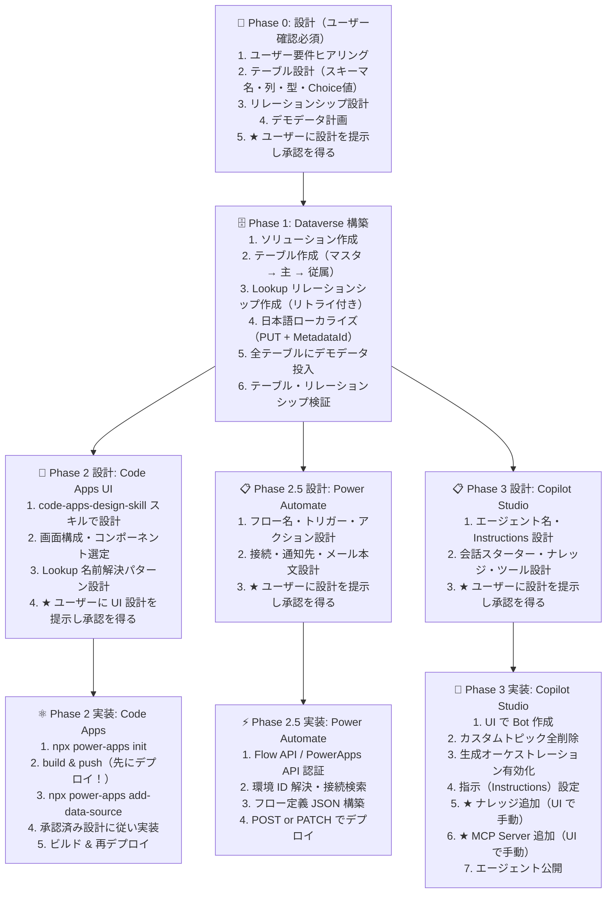

# Power Platform コードファースト開発標準

> Power Apps Code Apps・Dataverse・Copilot Studio を VS Code + GitHub Copilot でコードファーストに構築するための開発標準。  
> GitHub Copilot Agent モードとスキルベースの開発ワークフローにより、VS Code から Power Platform ソリューションを構築する実践ガイド。

> [!NOTE]
> 推奨モデル: Claude Opus 4.6

---

## 目次

1. [設計原則](#1-設計原則)
2. [前提条件と環境セットアップ](#2-前提条件と環境セットアップ)
3. [Dataverse テーブル設計・作成](#3-dataverse-テーブル設計作成)
4. [Code Apps 開発](#4-code-apps-開発)
5. [Power Automate フロー開発](#5-power-automate-フロー開発)
6. [Copilot Studio エージェント開発](#6-copilot-studio-エージェント開発)
7. [トラブルシューティング・再発防止](#7-トラブルシューティング再発防止)
8. [開発フロー全体図](#8-開発フロー全体図)
9. [チェックリスト](#9-チェックリスト)
10. [GitHub Copilot スキル](#10-github-copilot-スキル)

---

## 1. 設計原則

### 1.1 既存のシステムテーブルを最大限活用する

| やりがちなミス                         | 正しいアプローチ                               |
| -------------------------------------- | ---------------------------------------------- |
| 「報告者」カスタム Lookup を自作       | Dataverse 既定の `createdby`（作成者）列を利用 |
| 「担当者」用のカスタムユーザーテーブル | `systemuser` テーブルへの Lookup を設定        |
| ステータス管理テーブルを自作           | Choice（選択肢）列を使用                       |

> **教訓**: カスタム Lookup `ReportedById` を作成後に削除（`delete_reportedby_column.py`）する手戻りが発生した。`createdby` は自動で設定されるため、レコード作成者 = 報告者という設計が最もシンプル。

### 1.2 スキーマ名は英語、表示名は日本語

Dataverse のスキーマ名（Logical Name）は**必ず英語**で設計する。日本語の表示名は後工程でローカライズする。

```
✅ 正しい: テーブル {Prefix}_incident、列 {Prefix}_description
❌ 間違い: テーブル {Prefix}_インシデント、列 {Prefix}_説明
```

> **教訓**: `pac code add-data-source -a dataverse` コマンドが日本語表示名のテーブルで失敗する。スキーマ名を英語にすれば回避可能。

#### 日本語 DisplayName サニタイズエラーの回避方法

`@microsoft/power-apps` SDK v1.0.x では、`npx power-apps add-data-source` 実行時にテーブルの **DisplayName**（表示名）を TypeScript 識別子にサニタイズする処理がある。このサニタイズ関数は ASCII 文字のみを許容するため、日本語ローカライズ済みのテーブル（例: 表示名「インシデント」）で以下のエラーが発生する:

```
Failed to update database references: Failed to sanitize string インシデント
```

**原因**: `@microsoft/power-apps-actions/dist/CodeGen/shared/nameUtils.js` の `sanitizeName()` 関数内の正規表現:

```javascript
// 元のコード — ASCII 以外の文字をすべて _ に置換
name = name.replace(/[^a-zA-Z0-9_$]/g, "_");
```

日本語文字がすべて `_` に置換され、結果が全アンダースコア（`_____`）となり、バリデーションで弾かれる。

**回避方法**: 上記ファイルの正規表現を Unicode 文字を許容するように修正する:

```javascript
// 修正後 — CJK・ハングル・キリル・ラテン拡張など Unicode 文字を許容
name = name.replace(
  /[^a-zA-Z0-9_$\u00C0-\u024F\u0370-\u03FF\u0400-\u04FF\u3000-\u9FFF\uAC00-\uD7AF\uF900-\uFAFF]/g,
  "_",
);
```

**修正対象ファイル**:

```
node_modules/@microsoft/power-apps-actions/dist/CodeGen/shared/nameUtils.js
```

**修正手順**:

**重要**: PowerShell では `$` のエスケープ問題でパッチが適用されないことがある。**必ず Node.js スクリプト方式を使うこと。**

```javascript
// patch-nameutils.cjs — プロジェクトルートに配置
const fs = require("fs");
const p =
  "node_modules/@microsoft/power-apps-actions/dist/CodeGen/shared/nameUtils.js";
let c = fs.readFileSync(p, "utf8");
const oldPat = "[^a-zA-Z0-9_$]/g, '_')";
const newPat =
  "[^a-zA-Z0-9_$\\u00C0-\\u024F\\u0370-\\u03FF\\u0400-\\u04FF\\u3000-\\u9FFF\\uAC00-\\uD7AF\\uF900-\\uFAFF]/g, '_')";
if (c.includes(oldPat)) {
  c = c.replace(oldPat, newPat);
  fs.writeFileSync(p, c);
  console.log("Patched successfully");
} else {
  console.log("Already patched or pattern not found");
}
```

```bash
# パッチ適用
node patch-nameutils.cjs

# パッチ検証（適用後に必ず実行）
node -e "const c=require('fs').readFileSync('node_modules/@microsoft/power-apps-actions/dist/CodeGen/shared/nameUtils.js','utf8');c.split('\n').forEach((l,i)=>{if(l.includes('replace')&&l.includes('a-zA-Z'))console.log(i+':',l.trim())})"

# パッチ後にデータソース追加を実行
npx power-apps add-data-source --api-id dataverse \
  --resource-name {table_logical_name} \
  --org-url {DATAVERSE_URL} \
  --non-interactive
```

> **なぜ PowerShell ではダメなのか**: `$` は PowerShell で変数展開文字。正規表現内の `$` を含む文字列を `-replace` やバッククォートでエスケープしても、特殊文字の二重エスケープや `\u` Unicode エスケープの不整合でパッチが「適用されたように見えて実は変わっていない」問題が発生した。Node.js スクリプトなら JavaScript のネイティブ文字列処理でこの問題を回避できる。

> **注意**: `npm install` を再実行すると `node_modules` が再生成されパッチが消える。データソース追加のたびに `node patch-nameutils.cjs` を実行すること。

> **PAC CLI との関係**: `pac code add-data-source` は内部で `@microsoft/power-apps` の CLI スクリプトを呼び出す。SDK v1.0.x ではスクリプトパスが変更されたため `pac code` 経由では `Could not find the PowerApps CLI script` エラーになる。**`npx power-apps add-data-source` を使用すること**。

### 1.3 先にデプロイ、後から開発

ローカルでの開発に時間をかけすぎず、**最初に Power Platform にデプロイ**して Dataverse との接続を確立する。

```
✅ 正しい順序:
  1. npx power-apps init
  2. npm run build && npx power-apps push
  3. pac code add-data-source -a dataverse -t {table}
  4. 開発を進める

❌ 間違い順序:
  1. ローカルで全機能を開発
  2. 最後にデプロイ → Dataverse接続で問題発生 → 大幅手戻り
```

### 1.4 `power.config.json` は SDK で生成

`power.config.json` は **`npx power-apps init` コマンドで自動生成** する。手動でテンプレートを作成したり、他のプロジェクトからコピーしない。

```bash
# ✅ SDK コマンドで生成（appId, environmentId, region が自動設定される）
npx power-apps init --display-name "アプリ名" \
  --environment-id {ENVIRONMENT_ID} --non-interactive

# ❌ 手動で power.config.json を作成・編集する
# ❌ 別プロジェクトの power.config.json をコピーする（appId が環境固有のため失敗する）
```

| エラー                                          | 原因                                      | 対策                             |
| ----------------------------------------------- | ----------------------------------------- | -------------------------------- |
| `AppLeaseMissing` (409)                         | 別環境の `appId` がハードコードされている | `npx power-apps init` で新規生成 |
| `CodeAppOperationNotAllowedInEnvironment` (403) | 環境で Code Apps が未許可                 | §1.5 参照                        |

### 1.5 環境の Code Apps 有効化（前提条件）

Code Apps を新しい環境にデプロイするには、環境管理者が事前に Code Apps を許可する必要がある。

```
❌ 未許可の場合:
CodeAppOperationNotAllowedInEnvironment — The environment does not allow this operation for this Code app.

✅ 有効化手順:
1. Power Platform 管理センター → 環境 → 対象環境 → 設定
2. 製品 → 機能
3. 「コード アプリを許可する」→ オン
4. 保存（反映に数分かかることがある）
```

### 1.7 ソリューションベースで管理（最重要原則）

Dataverse テーブル・Code Apps・Power Automate フロー・Copilot Studio エージェントは **すべて同一のソリューション内** に含める。
ソリューション外のカスタマイズはリリース管理・環境間移行ができない。

```python
# .env に必ず定義 — 全フェーズ（Phase 0〜3）で同じ値を使用
SOLUTION_NAME=IncidentManagement
PUBLISHER_PREFIX={prefix}
```

| コンポーネント              | ソリューション紐づけ方法                                          |
| --------------------------- | ----------------------------------------------------------------- |
| Dataverse テーブル          | API ヘッダー `MSCRM.SolutionName` + `AddSolutionComponent` で検証 |
| Code Apps                   | `npx power-apps push`（環境 ID で自動紐づけ）                     |
| Power Automate フロー       | API ヘッダー `MSCRM.SolutionUniqueName`                           |
| 接続参照                    | API ヘッダー `MSCRM.SolutionUniqueName`                           |
| Copilot Studio エージェント | UI 作成時に「ソリューション」を選択                               |

> **重要**: `MSCRM.SolutionName` ヘッダーだけではテーブルがソリューションに含まれないケースがある。
> `setup_dataverse.py` は最終ステップで `AddSolutionComponent` API を呼び出し、
> 全テーブルがソリューションに含まれていることを検証・補完する。

> **各フェーズ用の詳細スキル** を `.github/skills/` に配置しています。
> 各スキルにもこの「一つのソリューション内に開発」原則を明記しています。
> 詳細は [§10. GitHub Copilot スキル](#10-github-copilot-スキル) を参照。

---

## 2. 前提条件と環境セットアップ

### 2.1 必須ツール

| ツール                        | 用途                | インストール                                 |
| ----------------------------- | ------------------- | -------------------------------------------- |
| VS Code                       | 統合開発環境        | [公式サイト](https://code.visualstudio.com/) |
| GitHub Copilot 拡張機能       | AI コーディング支援 | VS Code Marketplace                          |
| Power Platform Tools 拡張機能 | PAC CLI 連携        | VS Code Marketplace                          |
| Node.js (LTS)                 | Code Apps ビルド    | v18.x / v20.x                                |
| Python 3.10+                  | 自動化スクリプト    | Dataverse SDK 利用                           |
| PAC CLI                       | Power Platform CLI  | `npm install -g @microsoft/power-apps-cli`   |

### 2.2 .env ファイル設定

環境情報の取得は **Power Apps ポータル > 設定（右上の⚙）> セッション詳細** から取得する。

```
セッション詳細から取得できる値:
  Tenant ID      → TENANT_ID
  Environment ID → pac auth create の --environment 引数
  Instance URL   → DATAVERSE_URL
```

```bash
# === 必須（全フェーズ共通）===
DATAVERSE_URL=https://{org}.{region}.dynamics.com/
TENANT_ID={your-tenant-id}
SOLUTION_NAME={solution-name}
PUBLISHER_PREFIX={prefix}

# === オプション ===
PAC_AUTH_PROFILE={profile-name}
ADMIN_EMAIL=admin@example.com
BOT_ID=xxxxxxxx-xxxx-xxxx-xxxx-xxxxxxxxxxxx
```

### 2.3 認証

```bash
# PAC CLI 認証（Code Apps 用）
pac auth create --environment {environment-id}

# Python 依存パッケージ導入
pip install -r scripts/requirements.txt
```

#### 共通認証ヘルパー `scripts/auth_helper.py`

Dataverse テーブル作成・フロー・Copilot Studio 等の **Python デプロイスクリプト** は **`auth_helper`** モジュールを使って認証する。個別スクリプトに認証ロジックを書いてはならない。

> **注意**: Power Apps を利用するエンドユーザーの認証は Power Apps SDK が処理するため、本モジュールの対象外。

#### 2 層キャッシュ構成

サイレントリフレッシュには **AuthenticationRecord** と **MSAL 永続トークンキャッシュ** の両方が必要。

| 層                           | 保存先              | 保存内容                               | 役割                                      |
| ---------------------------- | ------------------- | -------------------------------------- | ----------------------------------------- |
| AuthenticationRecord         | `.auth_record.json` | アカウント情報（テナント・ユーザー）   | MSAL キャッシュからトークンを検索するキー |
| TokenCachePersistenceOptions | OS 資格情報ストア   | リフレッシュトークン・アクセストークン | 実際のトークン永続化                      |

> **教訓**: `AuthenticationRecord` だけではトークンは保存されない。`TokenCachePersistenceOptions` を設定しないと毎回デバイスコード認証が要求される。

| 動作             | 説明                                                                                                                         |
| ---------------- | ---------------------------------------------------------------------------------------------------------------------------- |
| 初回実行         | `DeviceCodeCredential` でデバイスコード認証 → `AuthenticationRecord` をファイルに保存 + MSAL キャッシュにトークンを永続化    |
| 2回目以降        | AuthenticationRecord をロード → MSAL キャッシュからリフレッシュトークンを取得 → サイレントリフレッシュ（デバイスコード不要） |
| エラー時の再実行 | 両方のキャッシュを再利用するため再認証は不要                                                                                 |

```python
# 基本的な使い方
from auth_helper import get_token, get_session, api_get, api_post, retry_metadata

# Dataverse Web API 用トークン取得
token = get_token()

# Flow API 用トークン取得（スコープ指定）
flow_token = get_token(scope="https://service.flow.microsoft.com/.default")

# PowerApps API 用トークン取得
pa_token = get_token(scope="https://service.powerapps.com/.default")

# Bearer ヘッダー付き Session 取得
session = get_session()

# Dataverse CRUD ヘルパー
data = api_get("EntityDefinitions")
record_id = api_post("accounts", {"name": "Contoso"})

# メタデータ操作のリトライ（0x80040237, 0x80044363 対応）
retry_metadata(lambda: api_post("EntityDefinitions", body), "テーブル作成")

# Flow API ヘルパー
from auth_helper import flow_api_call
envs = flow_api_call("GET", "/providers/Microsoft.ProcessSimple/environments")
```

```bash
# 認証テスト（初回のみデバイスコード認証が走る）
python scripts/auth_helper.py
```

> **ルール**: 認証レコード（`.auth_record.json`）は `.gitignore` に含まれ、リポジトリにコミットされない。何度もデバイスコード認証を求めるスクリプトは禁止。必ず `auth_helper` 経由で認証し、キャッシュを再利用すること。

### 2.4 Dataverse MCP サーバー設定

`.mcp/` ディレクトリ内に Dataverse MCP サーバー設定を配置する。これにより GitHub Copilot から直接テーブル操作が可能になる。

---

## 3. Dataverse テーブル設計・作成

### 3.1 テーブル設計のベストプラクティス

#### スキーマ設計ルール

| ルール                | 説明                                               | 例                                     |
| --------------------- | -------------------------------------------------- | -------------------------------------- |
| プレフィックス統一    | パブリッシャープレフィックスを全テーブル・列に統一 | `{Prefix}_incident`, `{Prefix}_name`   |
| 英語スキーマ名        | テーブル名・列名は英語                             | `{Prefix}_asset`（❌ `{Prefix}_設備`） |
| Lookup → systemuser   | ユーザー参照は SystemUser テーブル                 | `{Prefix}_assignedtoid → systemuser`   |
| 作成者は createdby    | 報告者・登録者のカスタム列は不要                   | `createdby` システム列を利用           |
| Choice で列挙値       | ステータス・優先度は Choice 列                     | `100000000=新規, 100000001=対応中`     |
| 主列は {Prefix}\_name | 各テーブルの主列名を統一                           | `{Prefix}_name`                        |

#### Choice 値の設計規則

```
100000000 = 最初の選択肢（Dataverse は 100000000 から開始）
100000001 = 2番目
100000002 = 3番目
...
```

> **注意**: 0, 1, 2... のような小さい値は使用不可。Dataverse のカスタム Choice は `100000000` 始まり。

### 3.2 テーブル作成の自動化

#### メタデータ競合エラー対策（0x80040237 / 0x80044363）

テーブルやリレーションシップを連続作成すると、Dataverse のメタデータロックでエラーが発生する。`auth_helper.retry_metadata()` を使用する。

> **注意**: Dataverse のエラーコード（`0x80040237` 等）は HTTP レスポンスボディの JSON に含まれるが、`requests.HTTPError` の `str(e)` には含まれない。`e.response.text` から抽出する必要がある。`auth_helper.retry_metadata()` はこの抽出を正しく行う。

```python
from auth_helper import retry_metadata, api_post

# auth_helper.retry_metadata() を使う（推奨）
retry_metadata(
    lambda: api_post("EntityDefinitions", table_body, solution=SOLUTION),
    "テーブル作成: {Prefix}_incident",
)
```

内部実装（参考）:

```python
def _extract_error_detail(exc: Exception) -> str:
    """requests.HTTPError の場合はレスポンスボディからエラーコードを抽出する。"""
    parts = [str(exc)]
    if isinstance(exc, requests.HTTPError) and exc.response is not None:
        parts.append(exc.response.text)  # ← ここに 0x80044363 等が含まれる
    return "\n".join(parts)
```

| エラーコード                   | 原因                                     | 対策                               |
| ------------------------------ | ---------------------------------------- | ---------------------------------- |
| `0x80040237`                   | メタデータ排他ロック競合                 | スキップして続行                   |
| `0x80044363`                   | ソリューション内に同名コンポーネント重複 | スキップして続行                   |
| `already exists`               | 重複作成                                 | スキップして続行                   |
| `another operation is running` | 別の公開処理が実行中                     | 累進的リトライ（10s, 20s, 30s...） |

#### テーブル作成順序

リレーションシップの依存関係を考慮した作成順序:

```
Phase 1: 参照先テーブル（マスタ系）
  1. {Prefix}_incidentcategory（カテゴリ）
  2. {Prefix}_assetcategory（設備種別）
  3. {Prefix}_location（設置場所）

Phase 2: 主テーブル
  4. {Prefix}_asset（設備）
  5. {Prefix}_incident（インシデント）

Phase 3: 従属テーブル
  6. {Prefix}_incidentcomment（コメント）

Phase 4: Lookup リレーションシップ作成
  - {Prefix}_incident → {Prefix}_incidentcategory
  - {Prefix}_incident → {Prefix}_asset
  - {Prefix}_incident → systemuser (担当者)
  - {Prefix}_asset → {Prefix}_location
  - {Prefix}_asset → {Prefix}_assetcategory
  - {Prefix}_incidentcomment → {Prefix}_incident
```

### 3.3 日本語ローカライズ

テーブル・列の表示名を日本語に設定する際は、**PUT メソッド + MetadataId** を使用する。

```python
# ❌ v1, v2: PATCH / POST → 失敗
# ✅ v3: GET で MetadataId 取得 → PUT で更新
def update_table_display(logical_name, display_jp, plural_jp):
    data = api_get(f"EntityDefinitions(LogicalName='{logical_name}')?$select=MetadataId,...")
    mid = data["MetadataId"]
    body = {
        "@odata.type": "#Microsoft.Dynamics.CRM.EntityMetadata",
        "MetadataId": mid,
        "DisplayName": label_jp(display_jp),
        "DisplayCollectionName": label_jp(plural_jp),
    }
    api_request(f"EntityDefinitions({mid})", body, "PUT")  # ← PUT が正解
```

> **教訓**: ローカライズスクリプトは v1 → v2 → v3 の 3 回作り直し。PATCH では `DisplayName` が反映されないケースがあり、最終的に GET → PUT パターンが安定。`MSCRM.MergeLabels: true` ヘッダーも必須。

### 3.4 不要列の削除手順

カスタム Lookup 列を削除する場合は、**リレーションシップ → 列** の順に削除する。

```python
# Step 1: ManyToOne リレーションシップを検索・削除
rels = api_get(f"/EntityDefinitions(LogicalName='{Prefix}_incident')/ManyToOneRelationships")
for r in rels["value"]:
    if r["ReferencingAttribute"] == "{Prefix}_reportedbyid":
        api_delete(f"/RelationshipDefinitions(SchemaName='{r['SchemaName']}')")
        time.sleep(10)  # メタデータ反映待ち

# Step 2: 列を削除
api_delete(f"/EntityDefinitions(LogicalName='{Prefix}_incident')/Attributes(LogicalName='{Prefix}_reportedbyid')")

# Step 3: カスタマイズを公開
api_post("/PublishAllXml", {})
```

---

## 4. Code Apps 開発

### 4.1 初期セットアップ手順

#### 前提条件

- 環境で **Code Apps が有効化**されていること（§1.6 参照）
- PAC CLI で**対象環境の認証プロファイル**が作成済みであること

```bash
# PAC CLI 認証プロファイル作成（初回のみ）
pac auth create --name {profile-name} --environment {ENVIRONMENT_ID}
# 例: pac auth create --name IncidentManager --environment xxxxxxxx-xxxx-xxxx-xxxx-xxxxxxxxxxxx

# 認証プロファイル確認（* が付いているのがアクティブ）
pac auth list
```

> **教訓**: `pac auth list` にターゲット環境がない状態で `npx power-apps push` を実行すると認証エラーになる。新しい環境では必ず `pac auth create` を先に実行すること。

#### セットアップ手順

```bash
# 1. プロジェクト初期化（power.config.json が SDK により自動生成される）
npx power-apps init --display-name "アプリ名" \
  --environment-id {ENVIRONMENT_ID} --non-interactive

# 2. 依存関係インストール
npm install

# 3. 先にビルド＆デプロイ（Dataverse 接続確立のため）
npm run build
npx power-apps push --non-interactive

# 4. Dataverse コネクタ追加（テーブルごとに実行）
#    → src/generated/ と .power/schemas/appschemas/dataSourcesInfo.ts が自動生成される
#    ※ 日本語 DisplayName でサニタイズエラーが出る場合は §1.2 の回避方法を参照
npx power-apps add-data-source --api-id dataverse \
  --resource-name {table_logical_name} \
  --org-url {DATAVERSE_URL} --non-interactive

# 5. 再ビルド（生成コードを含む）
npm run build
npx power-apps push --non-interactive
```

> **重要**: SDK コマンドが以下のファイルを自動生成する。これらを手動で作成・他プロジェクトからコピーしてはならない。
>
> | コマンド                         | 自動生成されるファイル                                                                                                                                                                         |
> | -------------------------------- | ---------------------------------------------------------------------------------------------------------------------------------------------------------------------------------------------- |
> | `npx power-apps init`            | `power.config.json`, `plugins/plugin-power-apps.ts`, `vite.config.ts`, `tsconfig*.json`, `eslint.config.js`, `index.html`, `package.json`, `src/main.tsx`, `src/App.tsx`, `components.json` 等 |
> | `npx power-apps add-data-source` | `src/generated/`（モデル・サービス）, `.power/schemas/appschemas/dataSourcesInfo.ts`                                                                                                           |

> **SDK v1.0.x への移行**: `pac code add-data-source` は SDK v1.0.x で CLI パスが変更されたため動作しない。`npx power-apps add-data-source` を使用すること。日本語ローカライズ済み環境では nameUtils.js のパッチが必要（§1.2 参照）。

### 4.2 DataverseService パターン

```typescript
// 基本CRUD操作（DataverseService 直接呼び出し — Canvas Apps パターン）
DataverseService.GetItems(table, query); // OData クエリで一覧取得
DataverseService.GetItem(table, id, query); // 単一レコード取得
DataverseService.PostItem(table, body); // レコード作成
DataverseService.PatchItem(table, id, body); // レコード更新
DataverseService.DeleteItem(table, id); // レコード削除
```

#### Lookup フィールドの設定（作成時）

```typescript
// 作成時: @odata.bind でリレーション設定
await DataverseService.PostItem("{Prefix}_incidents", {
  {Prefix}_name: "ネットワーク障害",
  {Prefix}_description: "本社3Fで接続不可",
  {Prefix}_priority: 100000000, // 緊急
  {Prefix}_status: 100000000, // 新規
  "{Prefix}_incidentcategoryid@odata.bind": `/{Prefix}_incidentcategories(${categoryId})`,
  "{Prefix}_assignedtoid@odata.bind": `/systemusers(${userId})`,
});
```

#### Lookup フィールドの読み取り（SDK サービスパターン — Code Apps 推奨）

**SDK 生成サービスでは Lookup 名フィールド（`createdbyname` 等）は返されない。**
`_xxx_value`（GUID）をクライアントサイドで名前解決する。

```typescript
// ① サービスラッパーの select に Lookup GUID を含める
export async function getIncidents(): Promise<{Prefix}_incidents[]> {
  const result = await {Prefix}_incidentsService.getAll({
    select: [
      "{Prefix}_incidentid", "{Prefix}_name", "{Prefix}_status", "{Prefix}_priority", "createdon",
      "_{Prefix}_incidentcategoryid_value", "_{Prefix}_assignedtoid_value",
      "_{Prefix}_itassetid_value", "_createdby_value",  // ← Lookup GUID
    ],
    orderBy: ["createdon desc"],
  });
  return result.data;
}

// ② 名前解決用サービス
export async function getSystemUsers() {
  const result = await SystemusersService.getAll({
    select: ["systemuserid", "fullname", "internalemailaddress"],
    filter: "isdisabled eq false and accessmode ne 3 and accessmode ne 4",
  });
  return result.data;
}

// ③ React コンポーネントで useMemo 名前解決マップ
const userMap = useMemo(() => {
  const m = new Map<string, string>();
  users.forEach((u) => m.set(u.systemuserid, u.fullname || u.internalemailaddress || ""));
  return m;
}, [users]);

// ④ テーブルカラムの render で GUID → 名前変換
{
  key: "_createdby_value",
  label: "報告者",
  render: (item) => {
    const v = item._createdby_value as string | undefined;
    return v ? userMap.get(v) || "" : "";
  },
}
```

> **注意**: DataverseService 直接呼び出しパターン（`$expand`）は Canvas Apps 等では使えるが、
> Code Apps の SDK 生成サービスでは Lookup 名フィールドが返されないため使えない。
> Code Apps では必ず上記の「GUID + クライアントサイド名前解決」パターンを最初から使うこと。

### 4.3 型定義とステータスマッピング

```typescript
// ステータスはフロントで日本語マッピング
export enum IncidentStatus {
  NEW = 100000000,
  IN_PROGRESS = 100000001,
  ON_HOLD = 100000002,
  RESOLVED = 100000003,
  CLOSED = 100000004,
}

export const statusLabels: Record<IncidentStatus, string> = {
  [IncidentStatus.NEW]: "新規",
  [IncidentStatus.IN_PROGRESS]: "対応中",
  [IncidentStatus.ON_HOLD]: "保留",
  [IncidentStatus.RESOLVED]: "解決済",
  [IncidentStatus.CLOSED]: "クローズ",
};

// Tailwind クラスも型安全に
export const statusColors: Record<IncidentStatus, string> = {
  [IncidentStatus.NEW]: "bg-blue-100 text-blue-800",
  [IncidentStatus.IN_PROGRESS]: "bg-yellow-100 text-yellow-800",
  // ...
};
```

### 4.4 SDK Lookup 名フィールドの未ポピュレート問題（補足）

`npx power-apps add-data-source` で生成される SDK サービスの `getAll()` / `get()` は、**フォーマット済み Lookup 名フィールド**（`createdbyname`, `{Prefix}_assignedtoidname`, `{Prefix}_incidentcategoryidname` 等）を **返さない**。

これは SDK の既知の制約であり、**初回デプロイから必ず発生する**。
回避策は §4.2 の「Lookup フィールドの読み取り」に定義した **`_xxx_value` + クライアントサイド名前解決パターン** を最初から適用すること。

```
❌ Lookup 名フィールドに直接依存（壊れるコード）
   item.createdbyname → undefined → 「-」表示
   item.{Prefix}_assignedtoidname → undefined → 担当者が空白

✅ §4.2 の推奨パターンを最初から使う
   _xxx_value（GUID）+ useMemo Map → 常に名前が表示される
```

### 4.5 技術スタック

| レイヤー          | 技術                                   |
| ----------------- | -------------------------------------- |
| UI フレームワーク | React 18 + TypeScript                  |
| スタイリング      | Tailwind CSS + shadcn/ui               |
| データフェッチ    | TanStack React Query                   |
| ルーティング      | React Router                           |
| ビルドツール      | Vite                                   |
| 状態管理          | React Query キャッシュ + React Context |

---

## 5. Power Automate フロー開発

### 5.1 開発方針

Power Automate クラウドフローを Python スクリプトから Management API で作成・デプロイする。通知・承認・バックグラウンド処理など、ユーザー操作の外で動く自動化処理に使用する。

> Power Automate は必須ではない。通知やバックグラウンド処理が不要なプロジェクトではこのセクションをスキップできる。

### 5.2 認証とスコープ

Flow API と PowerApps API でそれぞれ異なるスコープのトークンが必要。`auth_helper` の `get_token()` にスコープを渡すだけで自動的にキャッシュされた認証を利用する。

```python
from auth_helper import get_token, flow_api_call

# フロー管理 API 用（フローの CRUD）— auth_helper が認証を一元管理
token = get_token(scope="https://service.flow.microsoft.com/.default")

# 接続検索用（PowerApps API — 既存の接続を検索）
pa_token = get_token(scope="https://service.powerapps.com/.default")

# Flow API ヘルパー関数を使えばスコープ指定も不要
envs = flow_api_call("GET", "/providers/Microsoft.ProcessSimple/environments")
```

| API                 | スコープ                                      | 用途                               |
| ------------------- | --------------------------------------------- | ---------------------------------- |
| Flow Management API | `https://service.flow.microsoft.com/.default` | フローの作成・更新・削除・一覧取得 |
| PowerApps API       | `https://service.powerapps.com/.default`      | 環境内の接続を検索                 |

### 5.3 環境 ID の解決

`DATAVERSE_URL` から環境 ID を逆引きする。Flow API のエンドポイントには環境 ID が必要。

```python
FLOW_API = "https://api.flow.microsoft.com"
API_VER = "api-version=2016-11-01"

envs = flow_api_call("GET", "/providers/Microsoft.ProcessSimple/environments")
ENV_ID = None
for env in envs["value"]:
    props = env.get("properties", {})
    linked = props.get("linkedEnvironmentMetadata", {})
    instance_url = (linked.get("instanceUrl") or "").rstrip("/")
    if instance_url == DATAVERSE_URL:
        ENV_ID = env["name"]
        break
```

> **教訓**: `instanceUrl` と `DATAVERSE_URL` の末尾スラッシュの有無を `rstrip("/")` で統一しないとマッチしない。

### 5.4 接続の検索と前提条件

フローが使用するコネクタの接続は **環境内に事前作成** しておく必要がある。API で接続を自動作成することはできない。

```python
CONNECTORS_NEEDED = {
    "shared_commondataserviceforapps": "Dataverse",
    "shared_office365": "Office 365 Outlook",
}

POWERAPPS_API = "https://api.powerapps.com"

# 接続を検索し、Connected 状態のものを優先使用
for connector_name, display in CONNECTORS_NEEDED.items():
    url = f"{POWERAPPS_API}/providers/Microsoft.PowerApps/apis/{connector_name}/connections"
    # $filter=environment eq '{ENV_ID}' でフィルタ
    # statuses に "Connected" が含まれるものを優先
```

> **教訓**: 接続が未作成の場合、API コールは成功するが空配列が返る。スクリプトで明確にエラーを出し、[Power Automate 接続ページ](https://make.powerautomate.com/connections) への案内を表示すべき。

### 5.5 フロー定義の構築

Logic Apps ワークフロー定義スキーマ形式で JSON を組み立てる。

```python
definition = {
    "$schema": (
        "https://schema.management.azure.com/providers/"
        "Microsoft.Logic/schemas/2016-06-01/workflowdefinition.json#"
    ),
    "contentVersion": "1.0.0.0",
    "parameters": {
        "$authentication": {"defaultValue": {}, "type": "SecureObject"},
        "$connections": {"defaultValue": {}, "type": "Object"},
    },
    "triggers": {
        "When_status_changes": {
            "type": "OpenApiConnectionWebhook",
            "inputs": {
                "host": {
                    "apiId": "/providers/Microsoft.PowerApps/apis/shared_commondataserviceforapps",
                    "connectionName": "shared_commondataserviceforapps",
                    "operationId": "SubscribeWebhookTrigger",
                },
                "parameters": {
                    "subscriptionRequest/message": 3,         # Update
                    "subscriptionRequest/entityname": "{Prefix}_incident",
                    "subscriptionRequest/scope": 4,           # Organization
                    "subscriptionRequest/filteringattributes": "{Prefix}_status",
                    "subscriptionRequest/runas": 3,
                },
                "authentication": "@parameters('$authentication')",
            },
        }
    },
    "actions": { ... },
}
```

#### 接続参照

```python
connection_references = {
    "shared_commondataserviceforapps": {
        "connectionName": dataverse_conn,   # 検索で取得した接続名
        "source": "Invoker",                # 呼び出し元ユーザーの資格情報
        "id": "/providers/Microsoft.PowerApps/apis/shared_commondataserviceforapps",
    },
    "shared_office365": {
        "connectionName": outlook_conn,
        "source": "Invoker",
        "id": "/providers/Microsoft.PowerApps/apis/shared_office365",
    },
}
```

### 5.6 代表的アクションパターン

#### Dataverse レコード取得

```python
"Get_Creator": {
    "type": "OpenApiConnection",
    "inputs": {
        "host": {
            "apiId": "/providers/Microsoft.PowerApps/apis/shared_commondataserviceforapps",
            "connectionName": "shared_commondataserviceforapps",
            "operationId": "GetItem",
        },
        "parameters": {
            "entityName": "systemusers",
            "recordId": "@triggerOutputs()?['body/_createdby_value']",
            "$select": "internalemailaddress,fullname",
        },
        "authentication": "@parameters('$authentication')",
    },
}
```

#### Choice 値 → 日本語ラベル変換（Compose）

```python
"Compose_Status_Label": {
    "type": "Compose",
    "inputs": (
        "@if(equals(triggerOutputs()?['body/{Prefix}_status'],100000000),'新規',"
        "if(equals(triggerOutputs()?['body/{Prefix}_status'],100000001),'対応中',"
        "if(equals(triggerOutputs()?['body/{Prefix}_status'],100000002),'保留',"
        "if(equals(triggerOutputs()?['body/{Prefix}_status'],100000003),'解決済',"
        "if(equals(triggerOutputs()?['body/{Prefix}_status'],100000004),'クローズ','不明')))))"
    ),
}
```

#### 条件分岐 + メール送信

```python
"Check_Email": {
    "type": "If",
    "expression": {
        "not": {"equals": [
            "@coalesce(outputs('Get_Creator')?['body/internalemailaddress'],'')",
            "",
        ]}
    },
    "actions": {
        "Send_Email": {
            "type": "OpenApiConnection",
            "inputs": {
                "host": {
                    "apiId": "/providers/Microsoft.PowerApps/apis/shared_office365",
                    "connectionName": "shared_office365",
                    "operationId": "SendEmailV2",
                },
                "parameters": {
                    "emailMessage/To": "@outputs('Get_Creator')?['body/internalemailaddress']",
                    "emailMessage/Subject": "【通知】ステータスが変更されました",
                    "emailMessage/Body": "<html>...</html>",
                },
            },
        }
    },
}
```

### 5.7 デプロイとべき等パターン

既存フローを `displayName` で検索し、あれば PATCH・なければ POST する。

```python
FLOW_DISPLAY_NAME = "インシデントステータス変更通知"

# 既存フロー検索
flows_resp = flow_api_call("GET",
    f"/providers/Microsoft.ProcessSimple/environments/{ENV_ID}/flows")
existing_flow_id = None
for f in flows_resp["value"]:
    if f["properties"]["displayName"] == FLOW_DISPLAY_NAME:
        existing_flow_id = f["name"]
        break

# デプロイ
flow_payload = {
    "properties": {
        "displayName": FLOW_DISPLAY_NAME,
        "definition": definition,
        "connectionReferences": connection_references,
        "state": "Started",
    }
}

if existing_flow_id:
    flow_api_call("PATCH",
        f"/providers/Microsoft.ProcessSimple/environments/{ENV_ID}/flows/{existing_flow_id}",
        flow_payload)
else:
    flow_api_call("POST",
        f"/providers/Microsoft.ProcessSimple/environments/{ENV_ID}/flows",
        flow_payload)
```

### 5.8 デバッグとフォールバック

API 呼び出しが失敗した場合、フロー定義 JSON をファイルに出力して手動インポートに対応する。

```python
except RuntimeError as e:
    debug_path = "scripts/flow_definition_debug.json"
    with open(debug_path, "w", encoding="utf-8") as f:
        json.dump(flow_payload, f, ensure_ascii=False, indent=2)
    print(f"デバッグ用にフロー定義を保存: {debug_path}")
    # → Power Automate UI でインポート可能
```

### 5.9 ソリューション対応フローの作成（Dataverse Web API 方式）

> **TIPS**: Flow Management API（`api.flow.microsoft.com`）で作成したフローは **非ソリューション対応** であり、ソリューションに後から追加できない。ソリューション管理が必要な場合は **Dataverse の `workflow` テーブルに直接レコードを作成** する。

#### 5.9.1 Flow API 方式 vs Dataverse API 方式

| 項目                               | Flow Management API                           | Dataverse Web API（推奨）                         |
| ---------------------------------- | --------------------------------------------- | ------------------------------------------------- |
| エンドポイント                     | `api.flow.microsoft.com`                      | `{org}.crm*.dynamics.com/api/data/v9.2/workflows` |
| ソリューション対応                 | ❌ 非対応（後追加も不可）                     | ✅ `MSCRM.SolutionUniqueName` ヘッダーで自動追加  |
| 認証スコープ                       | `https://service.flow.microsoft.com/.default` | `{DATAVERSE_URL}/.default`                        |
| 接続の `authenticatedUserObjectId` | 必須（ないと 401 エラー）                     | 不要                                              |
| 環境 ID 解決                       | 必要（instanceUrl から逆引き）                | 不要（Dataverse URL に直接アクセス）              |

#### 5.9.2 Flow API 方式で発生する問題

```
# 典型的エラー: 接続の authenticatedUserObjectId が不足
{"error": {
  "code": "ConnectionMissingAuthenticatedUserObjectId",
  "message": "The connection '...' is missing the authenticated user object id."
}}
```

この問題は、DeviceCodeCredential で取得したトークンが接続所有者のブラウザセッション と一致しないために発生する。接続を再作成しても PowerApps API から `authenticatedUser` が返されないケースがある。

#### 5.9.3 Dataverse Web API 方式の実装

**必須フィールド**:

| フィールド      | 値           | 説明                                    |
| --------------- | ------------ | --------------------------------------- |
| `name`          | フロー表示名 | 検索用（べき等パターン）                |
| `type`          | `1`          | Definition                              |
| `category`      | `5`          | Modern Flow (Cloud Flow)                |
| `primaryentity` | `"none"`     | Cloud Flow では `"none"` 必須           |
| `statecode`     | `0`          | **Draft で作成**（直接 Activated 不可） |
| `statuscode`    | `1`          | Draft                                   |
| `clientdata`    | JSON 文字列  | フロー定義 + 接続参照 + schemaVersion   |

**重要な制約**:

- `statecode: 1`（Activated）で直接作成すると `statuscode: 2 is not valid for state Draft` エラー
- `primaryentity` がないと `Attribute 'primaryentity' cannot be NULL` エラー
- `clientdata` に `schemaVersion` がないと `Required property 'schemaVersion' not found` エラー

#### 5.9.4 clientdata の構造

```python
clientdata = {
    "properties": {
        "definition": {
            "$schema": "https://schema.management.azure.com/providers/Microsoft.Logic/schemas/2016-06-01/workflowdefinition.json#",
            "contentVersion": "1.0.0.0",
            "parameters": {
                "$authentication": {"defaultValue": {}, "type": "SecureObject"},
                "$connections": {"defaultValue": {}, "type": "Object"},
            },
            "triggers": { ... },
            "actions": { ... },
        },
        "connectionReferences": {
            "shared_commondataserviceforapps": {
                "connectionName": "{接続ID}",
                "source": "Embedded",
                "id": "/providers/Microsoft.PowerApps/apis/shared_commondataserviceforapps",
                "tier": "NotSpecified",
            },
            # ...
        },
    },
    "schemaVersion": "1.0.0.0",   # ← これが必須
}

# JSON 文字列に変換して workflow.clientdata に設定
workflow_body["clientdata"] = json.dumps(clientdata, ensure_ascii=False)
```

#### 5.9.5 ソリューション紐付け + 作成 → 有効化の2ステップ

```python
# ヘッダーに MSCRM.SolutionUniqueName を追加
headers = {
    "Authorization": f"Bearer {token}",
    "Content-Type": "application/json",
    "MSCRM.SolutionUniqueName": "IncidentManagement",  # ← ソリューション自動追加
}

# Step 1: Draft で作成
workflow_body = {
    "name": "インシデントステータス変更通知",
    "type": 1,
    "category": 5,
    "statecode": 0,        # Draft
    "statuscode": 1,       # Draft
    "primaryentity": "none",
    "clientdata": json.dumps(clientdata, ensure_ascii=False),
}
r = requests.post(f"{API}/workflows", headers=headers, json=workflow_body)
wf_id = r.headers["OData-EntityId"].split("(")[-1].rstrip(")")

# Step 2: 有効化
requests.patch(f"{API}/workflows({wf_id})", headers=headers,
    json={"statecode": 1, "statuscode": 2})
```

#### 5.9.6 べき等パターン（既存検索 → 削除 → 再作成）

```python
# 既存フロー検索（workflow テーブル内、category=5 が Cloud Flow）
existing = api_get(
    f"workflows?$filter=name eq '{FLOW_NAME}' and category eq 5"
    "&$select=workflowid,name,statecode"
)
if existing["value"]:
    wf_id = existing["value"][0]["workflowid"]
    requests.delete(f"{API}/workflows({wf_id})", headers=headers)

# 新規作成（上記 Step 1 → Step 2）
```

> **教訓**: Flow API で作成したフローは `workflow` テーブルに存在しないため、`AddSolutionComponent` でもソリューションに追加できない。最初から Dataverse Web API 方式で作成するのが正解。

#### 5.9.7 接続参照（Connection Reference）への変更

Dataverse Web API で作成したフローは **直接接続（Embedded）** モードで接続を埋め込む。
ソリューション内で「接続ではなく接続参照を使用する必要があります」という警告が表示される場合は、以下の手順で対応する。

> **推奨手順**: Power Automate UI でフローを開いて手動で接続参照に変更する。API での接続参照自動作成は `AzureResourceManagerRequestFailed` 等のエラーが発生しやすく安定しない。

**手順**:

```
1. Power Automate (https://make.powerautomate.com) でソリューション内のフローを表示する
2. 右ペインの「フローチェッカー」を開く
3. 「接続参照を使用する」セクションの修正方法にある
   「接続参照を追加するために接続を削除する」リンクをクリック
   → 直接接続が削除され、接続参照に自動変換される
4. フローを手動で「オンにする」
```

> **ポイント**: フローチェッカーの修正方法リンクをクリックするだけで接続参照への変換が完了する。個別アクションの変更は不要。

**接続参照が必要な理由**:

- ソリューションのエクスポート/インポート時に、ターゲット環境の接続に自動マッピングされる
- ALM（アプリケーションライフサイクル管理）が簡素化される
- 開発環境→本番環境の移行で接続の再設定が不要

**API での接続参照作成を試みた場合の問題点**:
| 問題 | 原因 |
|-----|------|
| `AzureResourceManagerRequestFailed` でフロー有効化できない | 接続参照と実接続の紐付けが ARM 上で未完了 |
| `connectionReferences` に `"source": "Invoker"` を設定してもフローが動作しない | 接続参照レコードは作成できても、フローランタイムが接続を解決できない |
| フロー定義内の `@{expressions}` が二重ブレース `@{{}}` になる | Python f-string と非 f-string の混在で `{}` のエスケープが不整合 |

> **教訓**: ソリューション対応フローの接続参照化は Power Automate UI で行うのが最も確実。フロー編集→接続承認→保存の3ステップで完了する。API で自動化しようとすると ARM との同期問題で不安定になる。

---

## 6. Copilot Studio エージェント開発

### 6.1 開発方針

Copilot Studio エージェントの **新規作成は Copilot Studio UI で行う**。Dataverse `bots` テーブルへの直接挿入では PVA Bot Management Service にプロビジョニングされず、エージェントが正常に動作しない。

作成後の設定（生成オーケストレーション有効化、Instructions 設定等）は Python スクリプトで自動化する。

```
1. Copilot Studio UI でエージェントを作成（手動）
2. スクリプトで設定を適用（カスタムトピック削除、生成オーケストレーション、Instructions）
3. ナレッジとツール（Dataverse MCP Server）を UI で手動追加
4. 公開
```

> **教訓**: Dataverse `bots` テーブルに直接レコードを挿入すると `botroutinginfo` が 404 になり Copilot Studio UI でエラーになる。Bot 作成は必ず UI で行うこと。

### 6.2 エージェント作成（Copilot Studio UI — 手動）

以下の手順で Copilot Studio UI からエージェントを作成する:

```
1. https://copilotstudio.microsoft.com/ にアクセス
2. 「+ 作成」をクリック
3. 「エージェント に名前をつける」ダイアログで以下を設定:
   - エージェント名: インシデント管理アシスタント
   - 「エージェント設定 (オプション)」を展開:
     - 言語: 日本語 (日本)
     - ソリューション: インシデント管理（IncidentManagement）
     - スキーマ名: {PREFIX}_incident_management_assistant
4. 「作成」をクリック
5. 作成後、ブラウザの URL をそのまま .env に貼り付け:
   BOT_ID=https://copilotstudio.../bots/xxxxxxxx-xxxx-xxxx-.../overview
   （GUID だけでも OK: BOT_ID=xxxxxxxx-xxxx-xxxx-xxxx-xxxxxxxxxxxx）
6. スクリプトを実行: python scripts/deploy_agent.py
   → URL から Bot ID を自動判別して設定を適用
```

> **ポイント**: ソリューションを指定することで、エージェントがソリューションコンポーネントとして管理される。スキーマ名は Publisher prefix 付きの英語名を指定する。BOT_ID には URL をそのまま貼り付けか、GUID を直接指定できる。

### 6.3 生成オーケストレーション設定

```python
# ★ 既存 configuration をディープマージして保持することが重要
bot_data = api_get(f"bots({bot_id})?$select=configuration")
existing_config = json.loads(bot_data.get("configuration", "{}") or "{}")

overrides = {
    "$kind": "BotConfiguration",
    "settings": {
        "GenerativeActionsEnabled": True,
    },
    "aISettings": {
        "$kind": "AISettings",
        "useModelKnowledge": True,
        "isFileAnalysisEnabled": True,
        "isSemanticSearchEnabled": True,
        "optInUseLatestModels": False,  # ★ True だと基盤モデルが GPT に強制変更される
    },
    "recognizer": {
        "$kind": "GenerativeAIRecognizer",
    },
}

# ★ ディープマージで gPTSettings・モデル選択・その他 UI 設定を保持
merged = deep_merge(existing_config, overrides)
api_patch(f"bots({bot_id})", {"configuration": json.dumps(merged)})
```

> **教訓**: `configuration` を丸ごと上書きすると `gPTSettings.defaultSchemaName` やモデル設定が消える。必ず GET → ディープマージ → PATCH。
> `optInUseLatestModels` は明示的に `False` を設定すること。

### 6.4 PVA ダブル改行 YAML フォーマット（最重要）

PVA パーサーは標準 YAML のシングル改行 (`\n`) を**構造行**として認識しない。  
構造行（kind, displayName, conversationStarters 等）はダブル改行 (`\n\n`) で区切る必要がある。  
ただし `instructions: |-` ブロック内のテキストはシングル改行で記述する。

```python
def _build_gpt_yaml():
    # instructions ブロック（シングル改行）
    inst_block = "\n".join(f"  {line}" for line in GPT_INSTRUCTIONS.splitlines())

    # conversationStarters（ダブル改行、クォートなし）
    starter_lines = []
    for p in PREFERRED_PROMPTS:
        starter_lines.append(f"  - title: {p['title']}")
        starter_lines.append(f"    text: {p['text']}")
    starters_block = "\n\n".join(starter_lines)

    return (
        "kind: GptComponentMetadata\n\n"
        f"displayName: {BOT_NAME}\n\n"
        f"instructions: |-\n{inst_block}\n\n"
        f"conversationStarters:\n\n{starters_block}\n\n"
    )
```

```
❌ yaml.dump() → PVA パーサーと非互換
❌ 全行シングル改行 → conversationStarters / quickReplies が UI に反映されない
❌ 全行ダブル改行 → instructions テキストが空行だらけになる
❌ conversationStarters の title/text をダブルクォートで囲む → PVA に反映されない
✅ 構造行はダブル改行、instructions ブロック内はシングル改行
✅ conversationStarters の title/text はクォートなし
```

> **教訓**: シングル改行の YAML を API で PATCH すると保存は成功するが、Copilot Studio UI には反映されない。参考エージェントの実際のデータを調査してダブル改行フォーマットを発見した。

### 6.5 ConversationStart トピックの設定

ConversationStart トピック（componenttype=9）も同じダブル改行フォーマット。

```python
lines = []
lines.append("kind: AdaptiveDialog")
lines.append("beginDialog:")
lines.append("  kind: OnConversationStart")
lines.append("  id: main")
lines.append("  actions:")
lines.append("    - kind: SendActivity")
lines.append(f"      id: {send_id}")
lines.append("      activity:")
lines.append("        text:")
lines.append(f"          - {greeting_text}")  # クォートなし
lines.append("        speak:")
lines.append(f'          - \"{greeting_text}\"')
lines.append("        quickReplies:")
for qr in QUICK_REPLIES:
    lines.append(f"          - kind: MessageBack")
    lines.append(f"            text: {qr}")

new_data = "\n\n".join(lines) + "\n\n"  # ダブル改行で結合
```

```
❌ シングル改行 → 送信ノードが消え、quickReplies が UI に反映されない
❌ 挨拶テキストに生改行 \n を含める → YAML が壊れる（スペースに置換する）
✅ 全行ダブル改行で結合
✅ actions 配下は 4 スペースインデント
```

### 6.6 基盤モデル選択の保持（aISettings）

PVA は GPT コンポーネントの `data` YAML 末尾に基盤モデル情報を格納する:

```yaml
aISettings:
  model:
    modelNameHint: Sonnet46
```

GPT コンポーネントの `data` を上書きすると、この `aISettings` セクションが消えてデフォルトモデル（GPT 4.1）に戻る。

```python
# ★ 更新前に既存データから aISettings セクションを抽出 → 新 YAML の末尾に付加
existing_data = ui_comp.get("data", "")
ai_idx = existing_data.find("\naISettings:")
if ai_idx < 0:
    ai_idx = existing_data.find("aISettings:")
if ai_idx >= 0:
    ai_settings_section = existing_data[ai_idx:].rstrip()
    final_yaml = new_yaml.rstrip("\n") + "\n\n" + ai_settings_section + "\n\n"
```

```
❌ GPT data を丸ごと上書き → 基盤モデルがデフォルトに戻る
✅ 更新前に aISettings セクションを抽出して保持
✅ 初回デプロイ後に UI でモデルを設定 → 2 回目以降のデプロイで保持される
```

> **教訓**: 初回デプロイでは `aISettings` が存在しないため保持できない。ユーザーに UI でモデルを設定してもらい、その後はスクリプト再実行でも保持される。

### 6.7 アイコン設定（PNG 形式必須）

Teams チャネルは SVG を受け付けない。**PNG 形式**で登録する必要がある。

| 項目          | 要件                                             |
| ------------- | ------------------------------------------------ |
| `iconbase64`  | `data:` prefix なしの生 Base64 PNG（任意サイズ） |
| `colorIcon`   | 192x192 PNG, < 100KB                             |
| `outlineIcon` | 32x32 PNG, 白い透明背景                          |

参照: https://learn.microsoft.com/en-us/microsoftteams/platform/concepts/build-and-test/apps-package#app-icons

```python
from PIL import Image, ImageDraw
import io, base64

# 3 サイズの PNG を生成
icon_main = draw_icon(240)                                    # iconbase64 用
icon_color = draw_icon(192)                                   # colorIcon 用
icon_outline = draw_icon(32, transparent_bg=True, outline_only=True)  # outlineIcon 用

def to_base64(img):
    buf = io.BytesIO()
    img.save(buf, format='PNG', optimize=True)
    return base64.b64encode(buf.getvalue()).decode('ascii')

# ★ iconbase64 は data: prefix なしの生 Base64 PNG
api_patch(f"bots({bot_id})", {"name": bot_name, "iconbase64": to_base64(icon_main)})

# ★ colorIcon / outlineIcon は専用サイズで設定
ami["teams"]["colorIcon"] = to_base64(icon_color)    # 192x192
ami["teams"]["outlineIcon"] = to_base64(icon_outline)  # 32x32
```

```
❌ SVG で登録 → Teams チャネルのアイコンが表示されない
❌ data:image/svg+xml;base64,... 形式 → Teams が受け付けない
❌ colorIcon と outlineIcon を同じ画像で登録 → outlineIcon は 32x32 白い透明背景が必要
✅ PNG 形式で 3 サイズ生成（240, 192, 32）
✅ data: prefix なしの生 Base64 PNG で登録
```

### 6.8 GPT コンポーネントの更新手順

```python
# 1. 保存した configuration から defaultSchemaName を取得
default_schema = saved_config.get("gPTSettings", {}).get("defaultSchemaName", "")

# 2. 既存 GPT コンポーネント（componenttype=15）を全取得
# 3. defaultSchemaName と一致するものを UI コンポーネントとして特定
# 4. 既存データから aISettings セクションを抽出して保持
# 5. 新しい YAML + aISettings を PATCH
# 6. 余分なコンポーネントを削除
```

### 6.9 Copilot Studio 用システムプロンプト設計テンプレート

以下は生成オーケストレーションモードで使用するシステムプロンプトのテンプレート（ダブル改行フォーマット）:

```yaml
kind: GptComponentMetadata

displayName: {エージェント名}

instructions: |-
  あなたは「{エージェント名}」です。{役割の説明}。

  ## 利用可能なテーブル
  {各テーブルのスキーマ定義: 列名、型、Choice値、Lookup先}

  ## 行動指針
  1. ユーザーの意図を正確に理解し、Dataverse のデータ操作を実行する
  2. レコード作成時は必須項目を確認してから実行
  3. 検索結果は見やすく整形して表示
  4. 日本語で丁寧に応答

conversationStarters:

  - title: レコードを検索

    text: {テーブル名}を検索して

  - title: 新規登録

    text: 新しい{レコード}を登録したいです

  - title: ステータス更新

    text: {レコード}のステータスを更新して
```

> **注意**: テンプレートの構造行間はダブル改行、instructions 内のテキストはシングル改行。conversationStarters の title/text はクォートなし。

### 6.10 ナレッジ・ツールの手動追加

以下の設定はプログラムからの追加が困難なため、**Copilot Studio の UI からユーザーが手動で追加** する:

#### ナレッジ（Knowledge）の追加

1. [Copilot Studio](https://copilotstudio.microsoft.com/) にアクセス
2. 対象エージェントを選択 → **ナレッジ** タブ
3. **Dataverse** を選択 → 対象テーブルを選択して追加

#### Dataverse MCP Server（ツール）の追加

1. **ツール** タブ → **Dataverse MCP Server** を追加
2. 必要なアクション（レコード作成・更新・削除）を有効化

### 6.11 エージェント公開とチャネル設定

**公開 → チャネル設定** の順序で実行する。

```python
# 1. エージェント公開
api_post(f"bots({bot_id})/Microsoft.Dynamics.CRM.PvaPublish", {})

# 2. 説明の設定（publish 後でないと上書きされる）
api_patch(f"botcomponents({comp_id})", {"description": BOT_DESCRIPTION})

# 3. Teams / Copilot チャネル設定（colorIcon / outlineIcon は専用 PNG）
set_channel_manifest(bot_id)

# 4. チャネル公開実行（再度 PvaPublish 含む）
publish_to_channels(bot_id)
```

---

## 7. トラブルシューティング・再発防止

### 7.1 発生した問題と解決策一覧

| #   | 問題                                                                                       | 原因                                                                                     | 解決策                                                                                    | 再発防止    |
| --- | ------------------------------------------------------------------------------------------ | ---------------------------------------------------------------------------------------- | ----------------------------------------------------------------------------------------- | ----------- |
| 1   | `pac code add-data-source -a dataverse` 失敗                                               | テーブル表示名が日本語                                                                   | スキーマ名を英語に統一                                                                    | §1.2 参照   |
| 2   | `ReportedById` Lookup が不要                                                               | `createdby` で代替可能                                                                   | 列とリレーションシップを削除                                                              | §1.1 参照   |
| 3   | テーブル連続作成で `0x80040237`                                                            | メタデータロック競合                                                                     | 累進的リトライ（10s→20s→30s）                                                             | §3.2 参照   |
| 4   | 日本語表示名が設定できない                                                                 | PATCH では反映されない                                                                   | GET → PUT + MetadataId                                                                    | §3.3 参照   |
| 5   | ローカル開発後にデプロイで失敗                                                             | Dataverse 接続が未確立                                                                   | 先にデプロイしてからdev                                                                   | §1.3 参照   |
| 6   | トピック開発後に全削除                                                                     | 生成オーケストレーションが最適                                                           | 最初からgen-orchモードで設計                                                              | §6.1 参照   |
| 7   | Copilot Studio からエージェント作成不可                                                    | API 直接挿入では PVA にプロビジョニングされない                                          | Copilot Studio UI で手動作成、API は設定変更のみ                                          | §6.2 参照   |
| 8   | ローカライズ 3回やり直し                                                                   | API の挙動不明                                                                           | v3 の PUT パターンを確立                                                                  | §3.3 参照   |
| 9   | 認証トークン期限切れ                                                                       | AuthenticationRecord のみ保存（トークン未永続化）                                        | `auth_helper.py` で AuthenticationRecord + TokenCachePersistenceOptions の 2 層キャッシュ | §2.3 参照   |
| 10  | Flow API トークン取得失敗                                                                  | スコープ指定誤り                                                                         | `https://service.flow.microsoft.com/.default` を使用                                      | §5.2 参照   |
| 11  | フロー作成時に接続エラー                                                                   | 環境内に接続が未作成                                                                     | Power Automate 接続ページで事前作成                                                       | §5.4 参照   |
| 12  | フロー環境が見つからない                                                                   | DATAVERSE_URL 末尾スラッシュ不一致                                                       | `rstrip("/")` で統一                                                                      | §5.3 参照   |
| 13  | `retry_metadata` でエラーコード検出不可                                                    | `str(e)` にレスポンスボディが含まれない                                                  | `e.response.text` からエラーコードを抽出                                                  | §3.2 参照   |
| 14  | テーブル作成で `0x80044363`                                                                | ソリューション内にコンポーネント重複                                                     | `retry_metadata` でスキップ                                                               | §3.2 参照   |
| 15  | `npx power-apps add-data-source` で `Failed to sanitize string`                            | SDK の `sanitizeName()` が ASCII のみ許容、日本語 DisplayName が全て `_` に変換される    | `nameUtils.js` の正規表現を Unicode 対応にパッチ                                          | §1.2 参照   |
| 16  | `pac code add-data-source` で `Could not find the PowerApps CLI script`                    | SDK v1.0.x で CLI スクリプトパスが変更                                                   | `npx power-apps add-data-source` を使用                                                   | §4.1 参照   |
| 17  | Flow API で作成したフローがソリューションに追加できない                                    | Flow API は非ソリューション対応フローを作成する。`workflow` テーブルにも存在しない       | Dataverse Web API の `workflows` テーブルに直接作成 + `MSCRM.SolutionUniqueName` ヘッダー | §5.9 参照   |
| 18  | Flow API で `ConnectionMissingAuthenticatedUserObjectId` エラー                            | DeviceCodeCredential のトークンが接続所有者と不一致                                      | Dataverse Web API 方式に切り替え（authenticatedUser 不要）                                | §5.9.2 参照 |
| 19  | Dataverse Web API でフロー作成時 `statuscode 2 is not valid for state Draft`               | `statecode=1` で直接作成不可                                                             | Draft（statecode=0）で作成後に PATCH で有効化                                             | §5.9.5 参照 |
| 20  | フロー作成時 `primaryentity cannot be NULL`                                                | Cloud Flow でも `primaryentity` が必須                                                   | `"primaryentity": "none"` を指定                                                          | §5.9.3 参照 |
| 21  | フロー作成時 `Required property 'schemaVersion' not found`                                 | `clientdata` に `schemaVersion` が不足                                                   | `clientdata` の最上位に `"schemaVersion": "1.0.0.0"` を追加                               | §5.9.4 参照 |
| 22  | ソリューション内フローで「接続参照を使用する必要があります」警告                           | フロー定義が直接接続（Embedded）を使用している                                           | Power Automate UI でフローを開いて手動で接続参照に変更                                    | §5.9.7 参照 |
| 23  | API 作成フローの Send Email Body が空                                                      | Python f-string と非 f-string 混在で `@{{}}` が二重ブレースになる                        | f-string 不要の行は `@{expression}` で単一ブレースにする                                  | §5.9.7 参照 |
| 24  | Dataverse `bots` テーブルに直接挿入した Bot が Copilot Studio でエラー                     | PVA Bot Management Service にプロビジョニングされない。`botroutinginfo` が 404           | Copilot Studio UI で作成し、API は設定変更のみに使用                                      | §6.2 参照   |
| 25  | `npx power-apps push` で `AppLeaseMissing` エラー（409）                                   | `power.config.json` に別環境の `appId` がハードコードされている                          | `appId` を空文字にして新規アプリとしてデプロイ                                            | §1.4 参照   |
| 26  | `npx power-apps push` で `CodeAppOperationNotAllowedInEnvironment`（403）                  | 環境で Code Apps が許可されていない                                                      | Power Platform 管理センターで「コード アプリを許可する」をオンにする                      | §1.6 参照   |
| 27  | `npm run build` で `Cannot find module dataSourcesInfo`（TS2307）                          | `.power/` が `.gitignore` で除外されており git clone 後に存在しない                      | `npx power-apps add-data-source` を全テーブルに対して再実行                               | §4.1 参照   |
| 28  | スクリプトで `get_token()` の引数不一致                                                    | 旧インターフェース `get_token(tenant, client, scope)` vs 新 `get_token(scope=...)`       | `auth_helper.get_token()` は `.env` から自動読み込み。`scope` キーワード引数のみ渡す      | §2.3 参照   |
| 29  | PAC CLI 認証プロファイル未設定で push 失敗                                                 | 新環境への認証プロファイルが存在しない                                                   | `pac auth create --name {name} --environment {env-id}` で作成                             | §4.1 参照   |
| 30  | nameUtils.js パッチが PowerShell で適用されない                                            | `$` のエスケープ問題で文字列置換が失敗する（適用されたように見えて実は変更されていない） | `patch-nameutils.cjs`（Node.js スクリプト）を使い、適用後に必ず検証する                   | §1.2 参照   |
| 31  | SDK の `createdbyname` / `{Prefix}_assignedtoidname` 等が `undefined`                      | SDK 生成サービスがフォーマット済み Lookup 名フィールドをポピュレートしない               | `_xxx_value`（GUID）を取得し、クライアントサイドで `useMemo` + Map で名前解決             | §4.4 参照   |
| 32  | deploy_flow.py の優先接続 ID が別環境で `ConnectionNotFound`                               | 接続 ID をハードコードしており、環境が変わると存在しない                                 | 優先接続のハードコードを削除し、毎回 PowerApps API で Connected 状態の接続を自動検索する  | §5.4 参照   |
| 33  | Python スクリプトで `api_get()` の戻り値に `.json()` を呼んでエラー                        | `auth_helper.api_get()` は dict を直返しする（Response ではない）                        | 戻り値の dict をそのまま使う。`.json()` を呼ばない                                        | §2.3 参照   |
| 34  | GPT コンポーネントの YAML をシングル改行で作成 → conversationStarters が UI に反映されない | PVA パーサーはシングル改行の構造行を認識しない                                           | 構造行はダブル改行 (`\n\n`)、instructions 内はシングル改行。title/text はクォートなし     | §6.4 参照   |
| 35  | ConversationStart をシングル改行 YAML で更新 → 送信ノードが消える                          | 同上。PVA ダブル改行フォーマットが必須                                                   | ConversationStart もダブル改行で全行を結合                                                | §6.5 参照   |
| 36  | GPT data 上書きで基盤モデルがデフォルト（GPT 4.1）に戻る                                   | PVA が data YAML 末尾に `aISettings.model.modelNameHint` を格納しており、上書きで消える  | 更新前に `aISettings` セクションを抽出して新 YAML 末尾に付加                              | §6.6 参照   |
| 37  | SVG アイコンで Teams チャネルのアイコンが表示されない                                      | Teams は SVG を受け付けない。PNG 形式が必須                                              | PNG 3 サイズ生成（240/192/32）、data: prefix なしの生 Base64、outlineIcon は白い透明背景  | §6.7 参照   |

### 7.2 共通のアンチパターン

```
❌ Dataverse テーブルを日本語スキーマ名で作成する
❌ ユーザー参照を独自テーブルで実装する（systemuser を使え）
❌ 作成者・報告者のカスタム列を作る（createdby を使え）
❌ ローカルで全部作り込んでからデプロイ
❌ トピックベースでエージェント開発を始める
❌ PATCH でメタデータ表示名を更新しようとする
❌ テーブル連続作成でリトライなし
❌ ソリューション外でカスタマイズする
❌ Flow API に Dataverse トークンを使い回す（スコープが異なる）
❌ 接続を API で自動作成しようとする（手動で事前作成が必要）
❌ フロー定義の失敗時にデバッグ JSON を保存しない
❌ pac code add-data-source を SDK v1.0.x で使う（npx power-apps add-data-source を使え）
❌ 日本語 DisplayName の sanitize 問題を放置する（nameUtils.js をパッチせよ）
❌ Flow API でソリューション対応フローを作ろうとする（Dataverse Web API を使え）
❌ workflow を statecode=1 で直接作成する（Draft → Activate の2ステップが必須）
❌ 個別スクリプトに認証ロジックを書く（auth_helper.py を使え）
❌ 認証レコードを保存せず毎回デバイスコード認証を要求する
❌ AuthenticationRecord だけ保存して TokenCachePersistenceOptions を設定しない（トークンが永続化されない）
❌ retry_metadata で str(e) だけチェックする（レスポンスボディの Dataverse エラーコードを見逃す）
❌ API で接続参照を自動作成してフロー有効化しようとする（Power Automate UI で手動変更が確実）
❌ Python f-string と通常文字列を混在させて @{{}} を二重ブレースにする（f-string 不要行は @{} 単一ブレース）
❌ Dataverse bots テーブルに直接 Bot を作成する（PVA にプロビジョニングされない。Copilot Studio UI で作成せよ）
❌ 別環境の appId を power.config.json に残したままデプロイする（AppLeaseMissing エラー。appId を空にせよ）
❌ 環境の Code Apps 有効化を確認せずにデプロイする（CodeAppOperationNotAllowedInEnvironment エラー）
❌ git clone 後に dataSourcesInfo.ts を再生成せずにビルドする（`npx power-apps add-data-source` で全テーブルを再追加）
❌ PAC CLI の認証プロファイルを作成せずに push する（pac auth create が必要）
❌ get_token() に旧インターフェース（3引数）で呼び出す（auth_helper は .env から自動読み込み。scope のみ指定）
❌ nameUtils.js パッチを PowerShell で適用しようとする（$ エスケープで失敗。node patch-nameutils.cjs を使え）
❌ SDK の createdbyname 等に依存して UI 表示する（undefined になる。_xxx_value + useMemo で名前解決せよ）
❌ deploy_flow.py に接続 ID をハードコードする（環境が変わると ConnectionNotFound。毎回自動検索せよ）
❌ api_get() の戻り値に .json() を呼ぶ（dict が直返し。そのまま使え）
❌ GPT コンポーネントの YAML をシングル改行で作成する（PVA は構造行にダブル改行が必要）
❌ yaml.dump() で GPT/ConversationStart の YAML を生成する（PVA パーサーと非互換）
❌ GPT data を丸ごと上書きして aISettings を消す（基盤モデルがデフォルトに戻る）
❌ conversationStarters の title/text をダブルクォートで囲む（PVA に反映されない）
❌ SVG アイコンを Teams チャネルに登録する（PNG 形式が必須。3 サイズ生成し data: prefix なしで登録）
❌ optInUseLatestModels を True にする（基盤モデルが GPT に強制変更される。明示的に False を設定）
```

---

## 8. 開発フロー全体図



### Phase 0: 設計フェーズの詳細

設計フェーズでは、**ユーザーの要件をもとにデータベース設計を行い、承認を得てから構築に進む**。
設計なしにテーブルを作成してはならない。

#### Step 1: ユーザー要件のヒアリング

ユーザーの依頼内容から以下を明確化する:

- **管理対象**: 何を管理するアプリか（インシデント、資産、タスク等）
- **必要なデータ**: どんな情報を記録するか（ステータス、優先度、カテゴリ等）
- **マスタデータ**: 何をマスタテーブル化するか（カテゴリ、場所、設備等）
- **操作**: CRUD、検索、フィルタ、通知、エージェント連携等
- **ユーザー**: 誰が使うか（担当者の割り当て、報告者の追跡等）

#### Step 2: テーブル設計の作成

以下の形式でテーブル設計書を作成し、ユーザーに提示する:

```markdown
## テーブル設計

### 1. {prefix}\_tablename（日本語名）— マスタ/主/従属

| 列名             | 型               | 必須 | 説明 |
| ---------------- | ---------------- | ---- | ---- |
| {prefix}\_name   | String (Primary) | ✅   | 名称 |
| {prefix}\_column | Type             |      | 説明 |

### リレーションシップ

| 参照元テーブル     | 列名                 | → 参照先テーブル   | 関係 |
| ------------------ | -------------------- | ------------------ | ---- |
| {prefix}\_incident | {prefix}\_categoryid | {prefix}\_category | N:1  |

### Choice 値

| 列名             | 値        | ラベル |
| ---------------- | --------- | ------ |
| {prefix}\_status | 100000000 | 新規   |

### デモデータ計画

| テーブル           | 件数 | 内容                            |
| ------------------ | ---- | ------------------------------- |
| {prefix}\_category | 5件  | ネットワーク、ハードウェア、... |
```

#### Step 3: ユーザー承認

- 「**この設計で進めてよいですか？**」と明示的に確認する
- フィードバックがあれば修正して再提示
- 承認を得てから Phase 1 に進む

> **教訓**: 設計フェーズを省略してテーブルを作成すると、リレーションシップの漏れ（カテゴリ↔インシデントの Lookup 未設定）、デモデータの漏れ（コメントテーブルにデータなし）、必要なマスタテーブルの漏れ（設備マスタ未作成）が発生する。設計レビューで防止できる。

### Phase 2/2.5/3 の設計フェーズ（各フェーズ共通原則）

**Dataverse だけでなく、Code Apps・Power Automate・Copilot Studio のいずれも、実装前に設計をユーザーに提示して承認を得る。**

#### Code Apps UI 設計（Phase 2 開始前）

`code-apps-design-skill` スキルを使い、以下を設計してユーザーに提示:

- 画面一覧（ページ名・ルート・各画面の役割）
- 各画面のコンポーネント構成（ListTable / StatsCards / FormModal / InlineEditTable 等）
- カラム定義と render 関数
- Lookup 名前解決パターン（`_xxx_value` + `useMemo` Map）
- ナビゲーション構造

#### Power Automate フロー設計（Phase 2.5 開始前）

以下を設計してユーザーに提示:

- フロー名・目的
- トリガー（何をきっかけに実行するか）
- アクション一覧（条件分岐・メール送信・Teams 通知・データ更新等）
- 必要な接続（Dataverse, Office 365 Outlook, Teams 等）
- 通知先・メール件名・本文の概要

#### Copilot Studio エージェント設計（Phase 3 開始前）

以下を設計してユーザーに提示:

- エージェント名・説明
- Instructions（指示テキストの全文案）
- 会話スターター（3〜5 個のサンプル質問）
- ナレッジソース（Dataverse テーブル / SharePoint / ファイル等）
- ツール（MCP Server）の有無と接続先

> **原則**: 各フェーズで「**この設計で進めてよいですか？**」と明示的に確認し、承認を得てから実装に進む。

---

## 9. チェックリスト

### 設計フェーズ（Phase 0）

- [ ] ユーザー要件をヒアリング済み
- [ ] テーブル設計書を作成済み（テーブル・列・型・Choice値・リレーションシップ・デモデータ）
- [ ] **ユーザーにテーブル設計を提示し、承認を得た**
- [ ] systemuser / createdby 活用方針を確認済み
- [ ] マスタテーブルの洗い出しが完了（カテゴリ、場所、設備等）
- [ ] 全 Lookup リレーションシップが設計書に記載済み
- [ ] デモデータが全テーブル（従属テーブル含む）に計画済み

### Code Apps UI 設計（Phase 2 開始前）

- [ ] `code-apps-design-skill` スキルで画面構成・コンポーネントを設計済み
- [ ] Lookup 名前解決パターン（`_xxx_value` + `useMemo` Map）を設計に含めた
- [ ] **ユーザーに UI 設計を提示し、承認を得た**

### Power Automate フロー設計（Phase 2.5 開始前）

- [ ] フロー名・トリガー・アクション一覧・接続・通知先を設計済み
- [ ] **ユーザーにフロー設計を提示し、承認を得た**

### Copilot Studio エージェント設計（Phase 3 開始前）

- [ ] エージェント名・Instructions・会話スターター・ナレッジ・ツールを設計済み
- [ ] **ユーザーにエージェント設計を提示し、承認を得た**

### Dataverse テーブル作成前

- [ ] `.env` ファイルに `DATAVERSE_URL`, `SOLUTION_NAME`, `PUBLISHER_PREFIX` を設定済み
- [ ] PAC CLI で認証済み（`pac auth list` で確認）
- [ ] `pip install -r scripts/requirements.txt` 実行済み
- [ ] `auth_helper.py` の認証テスト済み（`python scripts/auth_helper.py`）
- [ ] テーブル設計: スキーマ名は英語、プレフィックス統一
- [ ] ユーザー参照は `systemuser` Lookup を使用
- [ ] 報告者・作成者は `createdby` システム列を利用（カスタム列不要）
- [ ] Choice 値は `100000000` から開始

### Code Apps デプロイ前

- [ ] 環境で **Code Apps が有効化**されている（Power Platform 管理センター → 機能）
- [ ] PAC CLI 認証プロファイルが対象環境用に作成済み（`pac auth create --environment {env-id}`）
- [ ] `power.config.json` が `npx power-apps init` で生成済み
- [ ] `power.config.json` の `environmentId` が正しい
- [ ] `.power/schemas/appschemas/dataSourcesInfo.ts` が `npx power-apps add-data-source` で生成済み
- [ ] `npm run build` がエラーなし
- [ ] 先に初回デプロイ済み（Dataverse 接続確立済み）
- [ ] Dataverse コネクタ追加済み（`npx power-apps add-data-source`）
- [ ] 型定義と Choice マッピングが一致

### Power Automate フロー作成前

- [ ] Flow API 認証トークン取得済み（`auth_helper.get_token(scope="https://service.flow.microsoft.com/.default")`）
- [ ] 環境 ID を `DATAVERSE_URL` から解決済み
- [ ] 必要な接続が環境内に作成済み（Dataverse, Office 365 Outlook 等）
- [ ] 接続が `Connected` 状態であることを確認
- [ ] フロー定義の JSON を構築済み
- [ ] 接続参照で `source: "Invoker"` を使用
- [ ] 既存フロー検索 → 更新 or 新規作成のべき等パターンを使用
- [ ] 失敗時のデバッグ JSON 出力を実装

### Copilot Studio エージェント公開前

- [ ] 生成オーケストレーション有効化済み（`GenerativeActionsEnabled: true`）
- [ ] `GenerativeAIRecognizer` 設定済み
- [ ] カスタムトピック全削除済み
- [ ] 指示（Instructions）にテーブルスキーマ・行動指針・条件分岐を記載
- [ ] ナレッジに Dataverse テーブル追加済み（手動）
- [ ] Dataverse MCP Server 追加済み（手動）

---

## 参考リンク

- [Power Apps Code Apps 公式ドキュメント](https://learn.microsoft.com/ja-jp/power-apps/developer/code-apps/)
- [Power Automate クラウドフロー](https://learn.microsoft.com/ja-jp/power-automate/overview-cloud)
- [Power Automate Management API](https://learn.microsoft.com/ja-jp/power-automate/web-api)
- [Copilot Studio 公式ドキュメント](https://learn.microsoft.com/ja-jp/microsoft-copilot-studio/)
- [Dataverse Web API リファレンス](https://learn.microsoft.com/ja-jp/power-apps/developer/data-platform/webapi/overview)
- [CodeAppsTemplate](https://github.com/yuseidemo/CodeAppsTemplate)

---

## 10. GitHub Copilot スキル

本リポジトリには、GitHub Copilot エージェント（`PowerCodeAgent`）が利用する開発スキルが含まれる。
各スキルは実際の開発で遭遇した失敗と検証結果に基づく **実戦テスト済みのナレッジ** である。

### スキル一覧

| スキル名                        | 場所                                                                                                      | 用途                                                           |
| ------------------------------- | --------------------------------------------------------------------------------------------------------- | -------------------------------------------------------------- |
| `power-platform-standard-skill` | [.github/skills/power-platform-standard-skill/](../.github/skills/power-platform-standard-skill/SKILL.md) | Power Platform 包括開発標準（全体参照）                        |
| `copilot-studio-agent-skill`    | [.github/skills/copilot-studio-agent-skill/](../.github/skills/copilot-studio-agent-skill/SKILL.md)       | Copilot Studio エージェント構築（生成オーケストレーション）    |
| `power-automate-flow-skill`     | [.github/skills/power-automate-flow-skill/](../.github/skills/power-automate-flow-skill/SKILL.md)         | Power Automate クラウドフロー作成・デプロイ                    |
| `code-apps-dev-skill`           | [.github/skills/code-apps-dev-skill/](../.github/skills/code-apps-dev-skill/SKILL.md)                     | Code Apps 初期化・Dataverse 接続・開発・デプロイ               |
| `code-apps-design-skill`        | [.github/skills/code-apps-design-skill/](../.github/skills/code-apps-design-skill/SKILL.md)               | CodeAppsStarter デザインシステム・コンポーネント選定・画面設計 |

### スキルに記録されている主な教訓

#### Copilot Studio（`copilot-studio-agent-skill`）

- Bot 作成は API 不可 → Copilot Studio UI 必須
- GPT コンポーネント（componenttype=15）は UI が作成したものを特定して更新
- configuration を PATCH する際は既存値をマージ（gPTSettings を消さない）
- Instructions は `yaml.dump()` ではなく手動で `|-` ブロック形式を構築
- 説明は YAML 内ではなく `botcomponents.description` カラムに保存、publish 後に設定
- **ConversationStart YAML も `yaml.dump()` 禁止** — PVA パーサーと非互換なフォーマットが出力され、会話の開始メッセージ・クイック返信・推奨プロンプトが消える。全体を手動で文字列構築する
- **conversationStarters の title/text はダブルクォートで囲む** — 絵文字入りタイトルがパースエラーになる
- **bots テーブルの PATCH には `name` フィールドが必須** — 省略すると `Empty or null bot name` エラー (0x80040265)。既存名を GET して再送する
- **アイコンは SVG → Base64 → `bots.iconbase64` に API 登録** — `data:image/svg+xml;base64,...` 形式。ユーザーに UI アップロードを求めない
- **基盤モデルは API で正確に制御できない** — `optInUseLatestModels: False` にしても基盤モデルが GPT に戻るケースあり。UI で手動選択

#### Power Automate（`power-automate-flow-skill`）

- Flow API / PowerApps API / Dataverse API で認証スコープが異なる
- 接続は環境内に事前作成が必要（API で自動作成不可）
- 接続参照（Connection Reference）を使わないとソリューション移行時に警告
- f-string と Power Automate 式の `@{}` 二重ブレース問題に注意
- フロー有効化が API で失敗する場合あり → UI での手動有効化をフォールバック

#### Code Apps（`code-apps-dev-skill`）

- 先にデプロイ、後から開発（`npm run build && npx power-apps push` を最初に実行）
- `pac code` ではなく `npx power-apps` を使用（SDK v1.0.x のパス変更問題）
- 日本語 DisplayName で nameUtils.js のサニタイズエラー → Unicode パッチで回避
- DataverseService パターンで CRUD 操作を統一
- Choice 値は `100000000` 始まり

### エージェントモード

`PowerCodeAgent` エージェント（`.github/agents/PowerCodeAgent.agent.md`）が上記スキルを自動的に参照し、
開発標準に従った Power Platform 開発を実行する。

---

## ライセンス

MIT License — 詳細は [LICENSE](../LICENSE) を参照。

> 📝 本文書は実務経験・検証に基づき作成されています。
